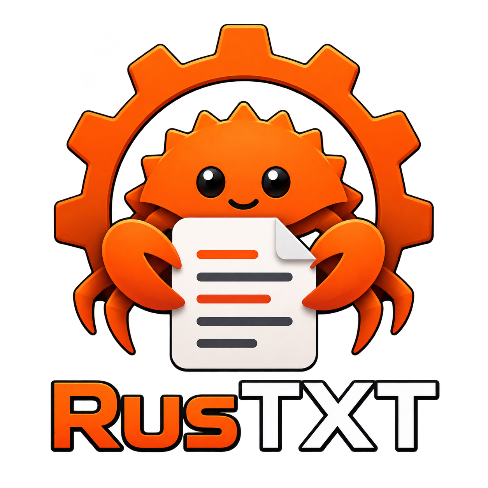
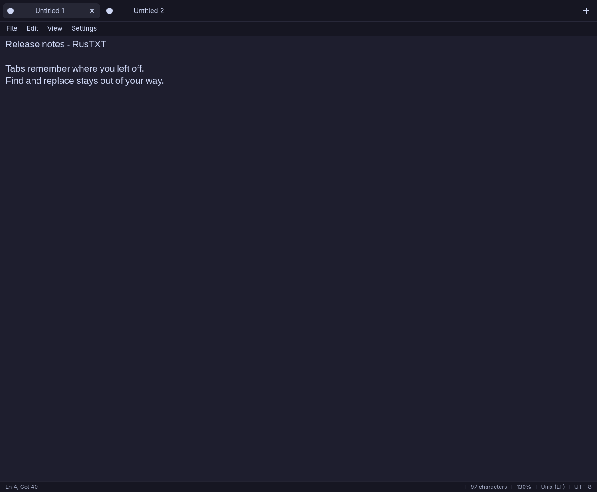

<p align="center"></p>

# RusTXT

A small, recoverable plain text editor built with Rust and Iced for Linux,
Windows, and macOS.

**RusTXT 0.5.0 is cross-platform:** Linux, Windows, and macOS use the same Iced
interface and recovery engine. GTK is no longer required by the released app.

## Download and install

Get the packages from [the latest release](https://github.com/tsubaie/RusTXT/releases/latest).

| Platform | Download and installation |
|---|---|
| Linux x86_64 | Extract the Linux `.tar.gz` and run `./install.sh`; requires glibc 2.35+ (Ubuntu 22.04+). |
| Arch / Omarchy | `sudo pacman -U rustxt-*.pkg.tar.zst` |
| Debian 13+ | `sudo apt install ./rustxt_*_amd64.deb` |
| Fedora 42+ | `sudo dnf install ./rustxt-*.x86_64.rpm` |
| Windows x86_64 | Extract the Windows ZIP and run `rustxt.exe`. No installer required. |
| macOS Apple Silicon | Extract `arm64-macos.zip` and move RusTXT.app to Applications. |
| macOS Intel | Extract `x86_64-macos.zip` and move RusTXT.app to Applications. |

Verify downloads with the release's `SHA256SUMS`. macOS bundles are ad-hoc signed,
not Apple-notarized; macOS may require **System Settings → Privacy & Security →
Open Anyway**. Windows executables are unsigned. Linux file dialogs need an XDG
desktop portal and a portal backend for your desktop. The tarball also needs
libxkbcommon (including its X11 library), Wayland, X11/Xcursor/Xi, and Fontconfig
runtime libraries; native Linux packages install those dependencies automatically.



## Features

- Tabs, keyboard shortcuts, file drag and drop, and single-instance file forwarding.
- SQLite recovery snapshots every 250 ms while editing, including unsaved notes.
- Undo/redo history and cursor/scroll positions restored across restarts.
- Close a tab and reopen it with Ctrl+Shift+T. Permanent discard requires confirmation.
- Find and replace with match counting, case sensitivity, whole words, and regex captures.
- Atomic file saves, external-change protection, symlink handling, and CRLF preservation.
- Arabic/English editing, Unicode font fallback, word wrap, zoom, and a status bar.
- System, light, dark, Omarchy, and custom themes; live configuration reloads.
- Native file dialogs. Printing opens a local print view in the default browser.

The interface uses in-window menus. On macOS, command shortcuts use Cmd; tab
cycling uses Ctrl+Tab. The About dialog links to the latest release rather than
updating the running executable automatically.

## Build and run

Use a current stable Rust toolchain:

```sh
cargo run --release -p rustxt-iced
cargo run --release -p rustxt-iced -- notes.txt
```

Linux needs the usual X11/Wayland and keyboard libraries. On Debian/Ubuntu:

```sh
sudo apt install build-essential pkg-config libxkbcommon-dev libxkbcommon-x11-0 libwayland-dev libfontconfig1-dev libx11-dev libx11-xcb1 libxcursor1 libxrandr-dev libxi-dev
```

File dialogs on Linux use the desktop's XDG portal. No GTK, libadwaita,
GtkSourceView, GPU, or browser runtime is required for the editor itself.
The renderer is Iced's CPU-based `tiny-skia` backend.

Windows uses the MSVC Rust toolchain and Visual Studio C++ build tools. macOS
uses the Rust toolchain and Xcode command-line tools. CI runs unit tests, renderer
regressions, and release builds on Linux, Windows, Apple Silicon macOS, and Intel
macOS. Real-window end-to-end editing, recovery, and hover tests run on Linux.

The GTK frontend remains in the repository for comparison (`cargo run -p rustxt`).
The default `cargo run` and `make run` commands start Iced.

## Existing notes and settings

Iced reads the same SQLite recovery database and TOML configuration as GTK.
Close GTK before opening Iced against the same session. To try a separate session:

```sh
RUSTXT_DATA_DIR=/tmp/rustxt-iced-review cargo run --release -p rustxt-iced
```

This changes the recovery location; appearance settings still use the normal
configuration directory. Linux and macOS retain the existing XDG/HOME layout:
`~/.config/rustxt/config.toml` and `~/.local/share/rustxt/session.db`. Windows uses
`%APPDATA%/rustxt` for configuration and `%LOCALAPPDATA%/rustxt` for recovery.

Undo history is stored as compact edits with an approximately 8 MiB per-tab
budget, retaining at least the latest edit. Files remain ordinary UTF-8 text.

## Development

```sh
make check        # formatting, clippy, core/editor tests
make build        # target/release/rustxt-iced
make e2e          # Linux: Xvfb, xdotool, ImageMagick, Python 3
```

```
crates/rustxt-core   recovery, safe file writes, configuration, themes
crates/rustxt-iced   the cross-platform frontend
crates/rustxt-gtk    the previous GTK frontend
vendor/             pinned Iced editor and renderer fixes, documented in vendor/README.md
```

See [migration and footprint report](docs/iced-migration.md) for measurements,
validation, and platform limits. The previous frontend's documentation is in
[GTK documentation](docs/gtk.md).

## License

MIT. Vendored Iced components retain their upstream MIT licenses.
