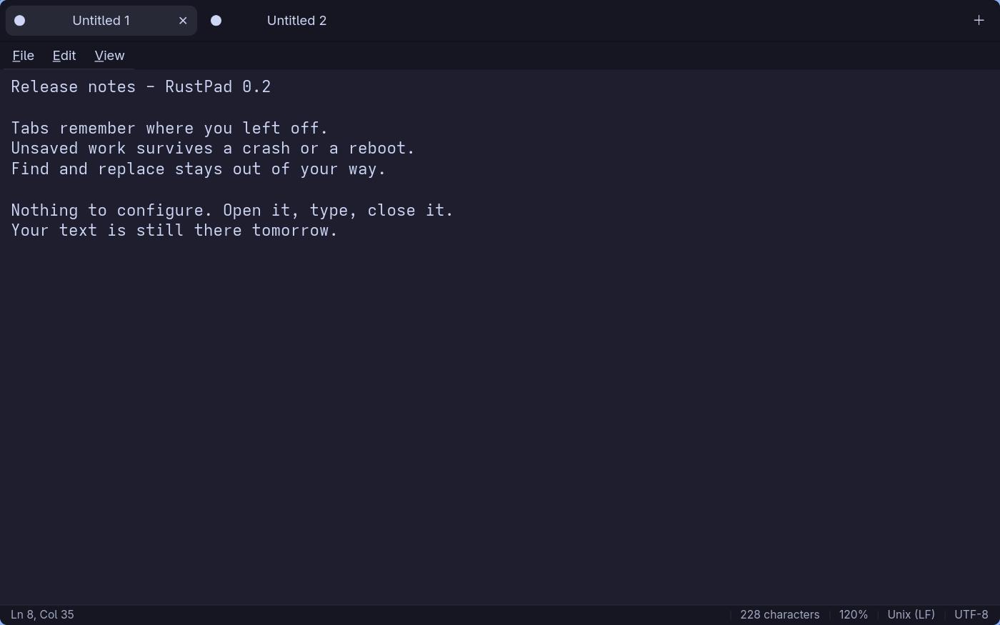
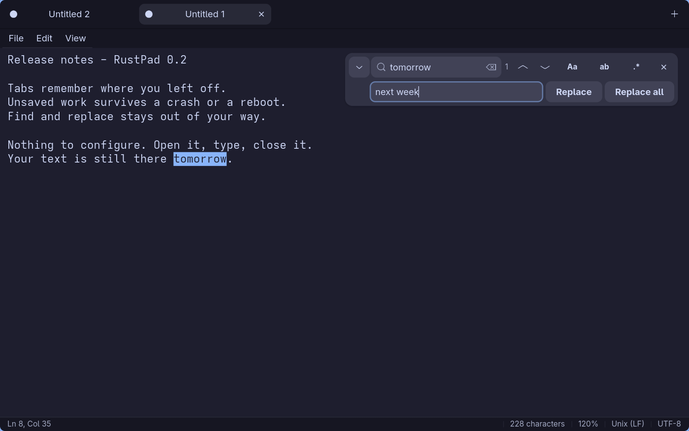
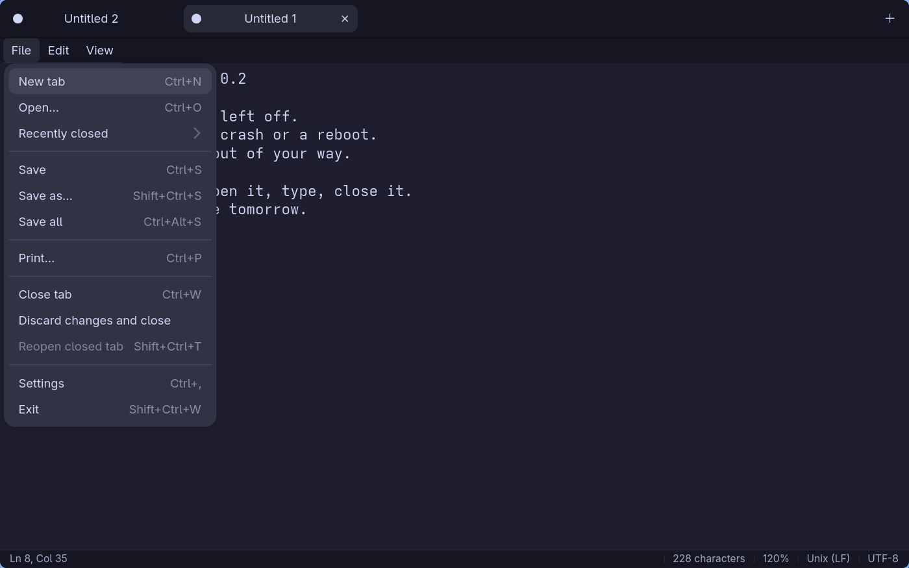
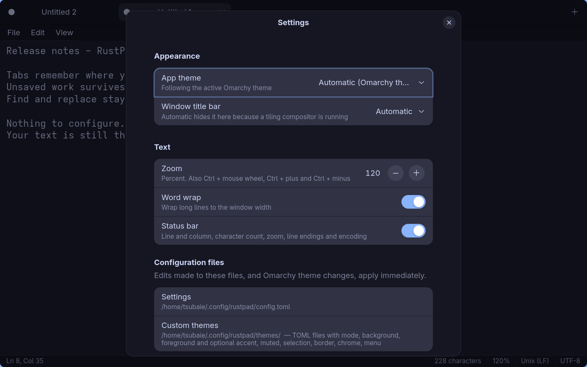
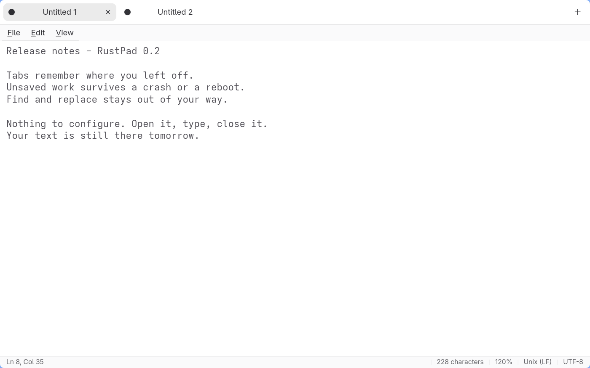
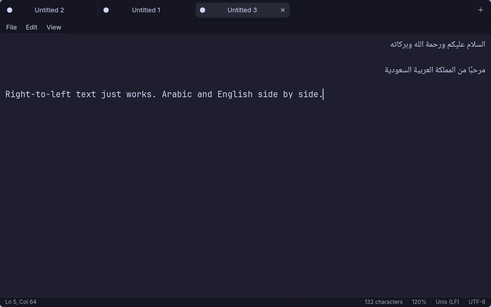

<p align="center">
  
</p>

<h1 align="center">RustPad</h1>

<p align="center">
  <strong>Dead simple. No BS. It never loses your text.</strong><br>
  A plain text editor for Linux and macOS that opens instantly, remembers everything, and stays out of your way.<br>
  <sub>No plugins. No AI sidebar. No account. No "What's new" popup. Just a place to type.</sub>
</p>

<p align="center">
  
  
  
  
</p>

<p align="center">
  
</p>

---

## Why RustPad

You wanted to write down a phone number. Your editor wanted to update, sync, sign you in, and recommend an extension. RustPad just opened.

**Opens instantly.** A real native app, not a browser in a box. Around 3 MB on disk, and it is on screen before you finish reaching for the keyboard. Your thought is still fresh when the cursor starts blinking.

**Never loses your work.** Every keystroke is saved to disk within half a second. Close the window, kill the process, pull the plug, let the laptop die at 1%. Open RustPad again and every tab, every unsaved line, and even your cursor position are exactly where you left them. It has never once asked "Do you want to save changes?" and it never will.

**Nothing to learn.** Tabs, a menu bar, find and replace, a status bar. The same conventions and shortcuts you already know from every text editor since Notepad. There is no tutorial because there is nothing to tutor.

**Just works.** Files are saved atomically, permissions are kept, symlinks are respected, and Windows or Unix line endings are preserved exactly as they were. Your text files stay ordinary text files, readable by anything, including your future self with a different editor.

## Screenshots

<table>
  <tr>
    <td align="center"><br><sub>Find and replace floats over the text and gets out of the way</sub></td>
    <td align="center"><br><sub>Real menus with real shortcuts, recently closed tabs included</sub></td>
  </tr>
  <tr>
    <td align="center"><br><sub>Settings: theme, title bar, zoom, word wrap, status bar. That is all of them</sub></td>
    <td align="center"><br><sub>Light, dark, system, or your Omarchy theme, switched live</sub></td>
  </tr>
  <tr>
    <td colspan="2" align="center"><br><sub>Right-to-left text just works: Arabic and English in the same document, each aligned the right way</sub></td>
  </tr>
</table>

## Features

- **Tabs that remember.** Each tab keeps its own undo history, cursor, and scroll position across restarts.
- **Close for now, or discard for good.** Closing a tab keeps its recovery copy, and closing the last tab closes RustPad. *File ▸ Recently closed* or `Ctrl+Shift+T` brings it back. *Discard changes and close* is the only way to lose text, and it asks first.
- **Find and replace** with match counting, match case, whole word, and regular expressions. `Ctrl+F`, `Ctrl+H`, `F3`, `Shift+F3`. Go to line with `Ctrl+G`.
- **Zoom** with `Ctrl` + wheel, `Ctrl+Plus`, `Ctrl+Minus`, `Ctrl+0`. Word wrap and status bar toggles in the *View* menu.
- **Native printing** through the system print dialog. Time and date stamp with `F5`.
- **Right-to-left text just works.** Arabic, Hebrew and Persian lines flow and align the way they should. Pair your monospace font with an Arabic face in Settings and both scripts look right side by side.
- **Line endings preserved.** Opens `CRLF` files and saves them back as `CRLF`. The status bar tells you which.
- **Open from the terminal.** `rustpad notes.txt todo.md`. A second launch hands its files to the running window.
- **Follows your desktop.** On [Omarchy](https://omarchy.org) it picks up the active theme's colors automatically and re-themes the moment you run `omarchy theme set`. On tiling compositors the redundant title bar disappears; on GNOME and macOS it stays.

## Install

### Download a package

Grab the latest build from the [Releases page](https://github.com/tsubaie/RustPad/releases/latest):

| Distro | File | Install |
|---|---|---|
| Arch Linux / Omarchy | `rustpad-*.pkg.tar.zst` | `sudo pacman -U rustpad-*.pkg.tar.zst` |
| Debian 13+ / Ubuntu 25.04+ | `rustpad_*_amd64.deb` | `sudo apt install ./rustpad_*_amd64.deb` |
| Fedora 42+ | `rustpad-*.x86_64.rpm` | `sudo dnf install ./rustpad-*.x86_64.rpm` |
| Any Linux | `rustpad-*-x86_64-linux.tar.gz` | extract, then `./install.sh` |

RustPad needs GTK 4.16, libadwaita 1.6 and GtkSourceView 5 or newer, which rules out Debian 12 and Ubuntu 24.04. Every release ships a `SHA256SUMS` file.

### Build from source

**Arch Linux / Omarchy**

```bash
omarchy pkg add gtk4 libadwaita gtksourceview5      # or: sudo pacman -S gtk4 libadwaita gtksourceview5
cargo install --path crates/rustpad-gtk
```

**Debian / Ubuntu**

```bash
sudo apt install libgtk-4-dev libadwaita-1-dev libgtksourceview-5-dev
cargo install --path crates/rustpad-gtk
```

**Fedora**

```bash
sudo dnf install gtk4-devel libadwaita-devel gtksourceview5-devel
cargo install --path crates/rustpad-gtk
```

**macOS**

```bash
brew install gtk4 libadwaita gtksourceview5
cargo install --path crates/rustpad-gtk
```

Then add the launcher entry and icon (Linux):

```bash
install -Dm644 data/com.tsubaie.rustpad.desktop ~/.local/share/applications/com.tsubaie.rustpad.desktop
install -Dm644 data/icons/com.tsubaie.rustpad.svg ~/.local/share/icons/hicolor/scalable/apps/com.tsubaie.rustpad.svg
```

Or just run it from the source tree with `cargo run -p rustpad`.

## Configuration

There is one file, and you will rarely need it: `~/.config/rustpad/config.toml`. RustPad writes it with comments on first launch, keeps it in sync with the Settings dialog, and picks up hand edits immediately.

```toml
[appearance]
theme = "auto"      # "auto", "system", "light", "dark", "omarchy", or a custom theme name
zoom = 100          # 10-500

[editor]
word_wrap = true
font = ""           # empty = system monospace; or e.g. "JetBrainsMono Nerd Font, Noto Naskh Arabic 12"

[window]
status_bar = true
title_bar = "auto"  # "auto", "show", "hide"
```

### Themes

`auto` follows your Omarchy theme when one is installed and the system light/dark setting otherwise. To make your own, drop a file in `~/.config/rustpad/themes/` and set `theme` to its name:

```toml
# ~/.config/rustpad/themes/solarized.toml
mode = "dark"            # "dark" or "light"
background = "#002b36"
foreground = "#839496"
accent = "#b58900"       # optional, as are the rest
muted = "#586e75"
selection = "#073642"
border = "#073642"
chrome = "#00212b"       # tab strip and window
menu = "#073642"         # menus and popovers
```

Palettes drive both the libadwaita widgets and the editor's color scheme, so the whole window follows.

## Keyboard shortcuts

| Action | Shortcut | Action | Shortcut |
|---|---|---|---|
| New tab | `Ctrl+N` or `Ctrl+T` | Find | `Ctrl+F` |
| Open | `Ctrl+O` | Replace | `Ctrl+H` |
| Save / Save as | `Ctrl+S` / `Ctrl+Shift+S` | Find next / previous | `F3` / `Shift+F3` |
| Save all | `Ctrl+Alt+S` | Go to line | `Ctrl+G` |
| Close tab | `Ctrl+W` | Time and date | `F5` |
| Reopen closed tab | `Ctrl+Shift+T` | Zoom in / out / reset | `Ctrl++` / `Ctrl+-` / `Ctrl+0` |
| Next / previous tab | `Ctrl+Tab` / `Ctrl+Shift+Tab` | Settings | `Ctrl+,` |
| Print | `Ctrl+P` | Exit | `Ctrl+Shift+W` |

Menus open with `Alt+F`, `Alt+E`, `Alt+V`, or `F10`.

## How it is built

```
crates/rustpad-core   documents, recovery storage, config, themes. No GTK. Unit tested on its own.
crates/rustpad-gtk    the application: window, tabs, find bar, menus, settings, printing.
data/                 desktop entry and icon.
```

- **GTK 4 + libadwaita** through `gtk4-rs`, **GtkSourceView 5** for the editor.
- **SQLite** (WAL mode) for tabs, unsaved snapshots, cursor and scroll positions, and recently closed tabs. Only the tab you are typing in is written, and only after you pause.
- **TOML** configuration watched with `notify` so edits and theme changes apply live.
- Saves go through a temporary file and an atomic rename, keep the original permissions, and write through symlinks.

```bash
cargo test -p rustpad-core      # core unit tests
cargo build --release           # optimized binary with LTO
```

## Roadmap

- Encoding and line-ending controls, external-change detection, recent files, font settings.
- Markdown preview, spellcheck, export.
- Large-file mode, command palette, a carefully permissioned extension model.
- Optional, provider-neutral writing tools that run locally or with a provider you configure.

## Contributing

Issues and pull requests are welcome. Keep the core toolkit-free and covered by tests, and keep the interface boring in the best way: if a feature needs a manual, it probably does not belong in a notepad.

## License

RustPad is released under the [MIT License](LICENSE).
